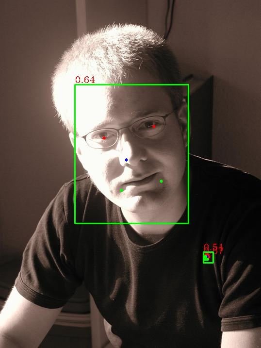
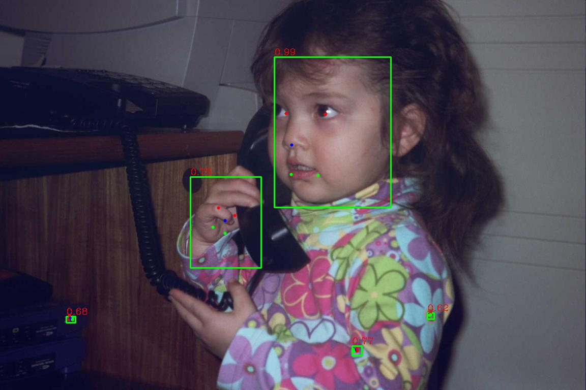
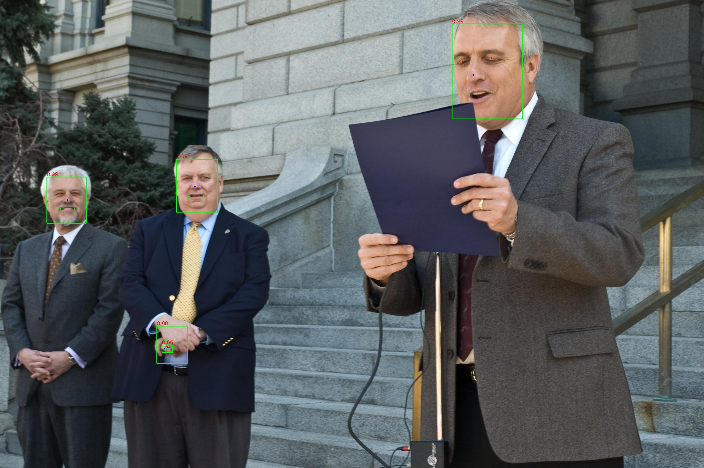
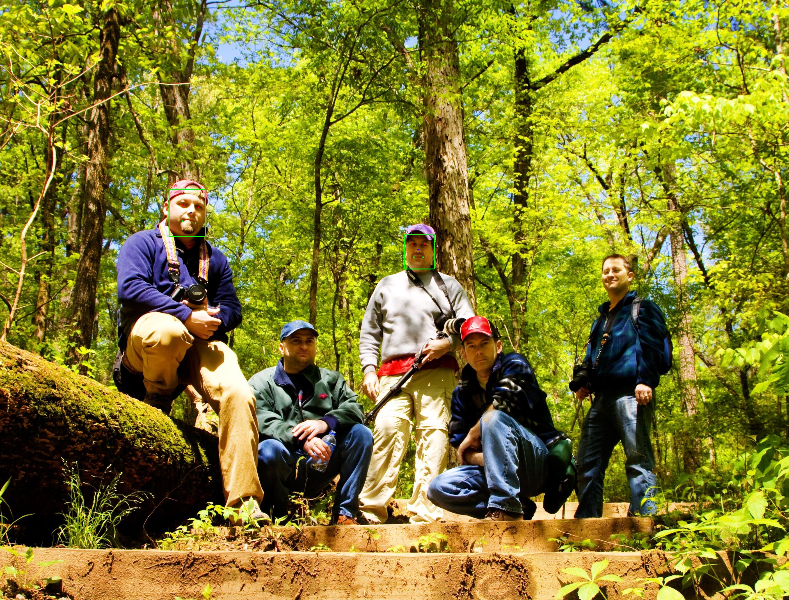
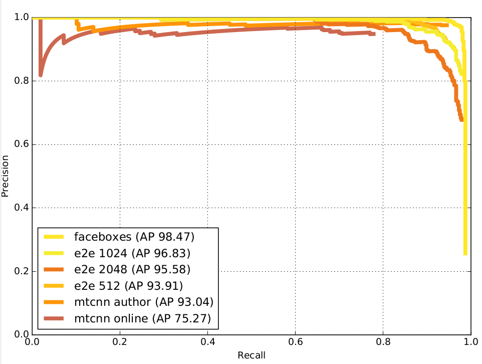

- [e2e](https://github.com/KaleidoZhouYN/e2e-joint-face-detection-and-alignment)支持360度人脸检测（给出人脸框和5个点），提供预训练模型，效果不错。

- [faceBoxes](https://github.com/zisianw/FaceBoxes.PyTorch),A [PyTorch](https://pytorch.org/) implementation of [FaceBoxes: A CPU Real-time Face Detector with High Accuracy](https://arxiv.org/abs/1708.05234). The official code in Caffe can be found [here](https://github.com/sfzhang15/FaceBoxes).提供预训练模型，效果不错。

  - e2e基本原理：图像金字塔实现多尺度预测，最小输入图为32×32，最大输入图为2048*2048，用pnet最后一个feature map预测box和class，用onet预测5个点坐标。

  - e2e实测效果：

    - 虚警过高，阈值无法解决这个问题（有些虚警点conf高达9.x，有些真正人脸框点cof只有6.x

    - 

      

      

      

    - 缩小输入图片大小，最大为1024*1024，可减少部分虚警，但虚警依然过多，最大为512×512，虚警降低很多，但是也会出现人脸漏检

    - 

      

    - 

    - 通过面积过滤？？？？手部误检难排除

      

  - AFW数据集评测

    

  - PASCAL数据集评测

  - 

  - widerFace数据集评测

    

